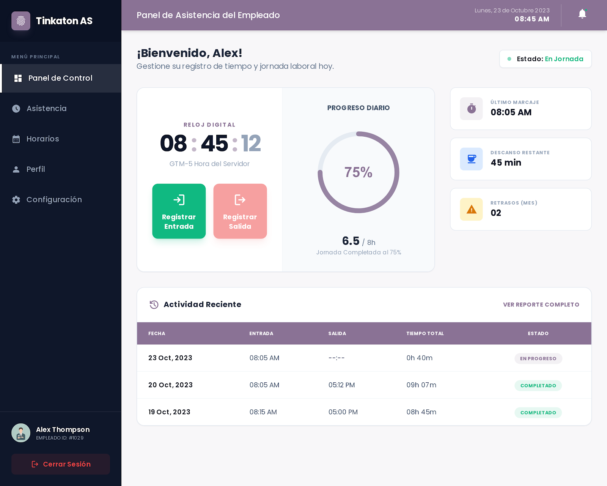

# Sistema de registro de asistencia

> **Proyecto educativo ** — Aprende a construir una aplicación real con Laravel 10, Vue 3 y Docker desde cero.

---

## Vista Previa del Sistema
| Login | Panel Principal |
|-------|----------------|
|  |  |

## Tabla de Contenidos

- [Descripción del Proyecto](#descripción-del-proyecto)
- [Stack Tecnológico](#stack-tecnológico)
- [Requerimientos Funcionales](#requerimientos-funcionales)
- [Arquitectura del Proyecto](#arquitectura-del-proyecto)
- [Convenciones de Nomenclatura](#convenciones-de-nomenclatura)
- [Convenciones de Base de Datos](#convenciones-de-base-de-datos)
- [Convenciones de API (Rutas)](#convenciones-de-api-rutas)
- [Estructura de Archivos SASS](#estructura-de-archivos-sass)
- [Configuración de Entorno con Docker](#configuración-de-entorno-con-docker)
- [Instalación Paso a Paso](#instalación-paso-a-paso)
- [Hoja de Ruta de Contenido](#hoja-de-ruta-de-contenido)
- [Extensiones Recomendadas (VS Code)](#extensiones-recomendadas-vs-code)
- [Contribución](#contribución)

---

## Descripción del Proyecto

**Sistema de registro de asistencia** es una aplicación web empresarial que permite registrar la entrada y salida de empleados, generar reportes de horas trabajadas y gestionar el personal de una organización. El proyecto está pensado como un **recurso de aprendizaje**, donde cada sesión cubre un módulo real del sistema.

### ¿Qué aprenderás construyendo este proyecto?

- Levantar un entorno de desarrollo profesional con **Docker** (aplicativo web + DB separados)
- Diseñar e implementar una **API RESTful** con **Laravel 10**
- Construir interfaces con **Vue 3** (Options API)
- Implementar **SASS** usando una arquitectura organizada (variables, mixins, componentes)
- Integrar **iconos SVG** mediante Pictogrammers/NPM
- Flujo completo: autenticación, marcación de asistencia y reportes

---

## Stack Tecnológico

| Capa | Tecnología | Versión |
|---|---|---|
| Backend | Laravel | 10.x |
| Lenguaje PHP | PHP | 8.2+ |
| Frontend | Vue | 3.x (Composition API) |
| Base de Datos | MySQL | 8.0 |
| Build Frontend | Vite | 5.x |
| Estilos | SASS/SCSS | - |
| Iconos | Pictogrammers | - |
| Infraestructura | Docker + Docker Compose | - |
| Editor | VS Code | - |
| Administrador de base de datos | DBeaver | - |


---

## Requerimientos Funcionales

### Módulo 1 — Autenticación

- El usuario puede iniciar sesión con correo electrónico y contraseña.
- El sistema genera un token de sesión al autenticarse correctamente.
- El usuario puede cerrar sesión de forma segura.
- Las rutas protegidas redirigen al login si no hay sesión activa.

### Módulo 2 — Marcación de Asistencia

- El empleado puede registrar su **entrada** con fecha y hora exacta.
- El empleado puede registrar su **salida** al finalizar la jornada.
- El sistema impide doble marcación de entrada sin salida previa registrada.
- Se muestra el estado actual del empleado: "Dentro" o "Fuera".

### Módulo 3 — Reportes de Horas

- El administrador puede consultar el reporte de asistencia por empleado y rango de fechas.
- El reporte muestra: empleado, fecha, hora de entrada, hora de salida, total de horas trabajadas.
- Los reportes se pueden exportar (futuras versiones: PDF/Excel).

### Módulo 4 — Gestión de Empleados

- El administrador puede crear, editar, listar y desactivar empleados.
- Cada empleado tiene: nombre, apellido, correo, cargo, departamento y estado (activo/inactivo).
- El administrador puede asignar roles: `admin` o `empleado`.

---

## Arquitectura del Proyecto

```
sistema-asistencia/
├── app/                        # Lógica de negocio 
│   ├── Http/
│   │   ├── Controllers/
│   │   │   ├── Auth/
│   │   │   │   └── AutenticacionControlador.php
│   │   │   ├── AsistenciaControlador.php
│   │   │   ├── EmpleadoControlador.php
│   │   │   └── ReporteControlador.php
│   │   ├── Middleware/
│   │   │   └── VerificarRol.php
│   │   └── Requests/
│   │       ├── GuardarEmpleadoRequest.php
│   │       └── RegistrarMarcacionRequest.php
│   ├── Models/
│   │   ├── Usuario.php
│   │   ├── Empleado.php
│   │   ├── Asistencia.php
│   │   └── Departamento.php
│   └── Services/
│       ├── AsistenciaServicio.php
│       └── ReporteServicio.php
│
├── database/
│   └── sql/
│       ├── 01_crear_base_de_datos.sql   # Crea el schema y selecciona la DB
│       ├── 02_crear_tablas.sql          # DDL: CREATE TABLE de todas las entidades
│       ├── 03_relaciones_y_llaves.sql   # ALTER TABLE: llaves foráneas e índices
│       └── 04_datos_iniciales.sql       # INSERT: usuario admin y datos de prueba
│
├── resources/
│   ├── js/
│   │   ├── componentes/            # Componentes Vue reutilizables
│   │   │   ├── comun/
│   │   │   │   ├── BarraNavegacion.vue
│   │   │   │   ├── BotonAccion.vue
│   │   │   │   └── TablaDatos.vue
│   │   │   ├── asistencia/
│   │   │   │   ├── TarjetaMarcacion.vue
│   │   │   │   └── ResumenJornada.vue
│   │   │   └── empleados/
│   │   │       ├── FormularioEmpleado.vue
│   │   │       └── ListaEmpleados.vue
│   │   ├── vistas/                 # Páginas/vistas Vue
│   │   │   ├── Login.vue
│   │   │   ├── Panel.vue
│   │   │   ├── Asistencia.vue
│   │   │   ├── Empleados.vue
│   │   │   └── Reportes.vue
│   │   ├── router/
│   │   │   └── index.js
│   │   ├── mixins/        
│   │   │   ├── AutenticacionMixin.js
│   │   │   └── AsistenciaMixin.js
│   │   ├── servicios/              # Llamadas a la API
│   │   │   ├── api.js              
│   │   │   ├── autenticacion.js
│   │   │   ├── empleados.js
│   │   │   └── asistencia.js
│   │   └── app.js
│   │
│   └── scss/                       # Ver sección SASS más adelante
│       ├── main.scss
│       ├── base/
│       ├── componentes/
│       └── vistas/
│
├── routes/
│   ├── api.php                     # Rutas de la API
│   └── web.php
│
├── docker/
│   ├── app/
│   │   └── Dockerfile
│   └── mysql/
│       └── Dockerfile
│
├── docker-compose.yml
├── vite.config.js
├── .env.example
└── README.md
```

---

## Convenciones de Nomenclatura

### PHP / Laravel

| Elemento | Convención | Ejemplo |
|---|---|---|
| Modelos | PascalCase, en español | `Empleado`, `Asistencia` |
| Controladores | PascalCase + "Controlador" | `EmpleadoControlador` |
| Servicios | PascalCase + "Servicio" | `AsistenciaServicio` |
| Métodos | camelCase, verbos en español | `obtenerTodos()`, `guardar()` |
| Variables | camelCase | `$horaEntrada`, `$totalHoras` |


### Vue 3 / JavaScript

| Elemento | Convención | Ejemplo |
|---|---|---|
| Componentes (.vue) | PascalCase | `TarjetaMarcacion.vue` |
| Composables | camelCase + "use" | `useAutenticacion.js` |
| Archivos de servicio | camelCase | `empleados.js` |
| Variables | camelCase | `empleadoActual` |
| Eventos emitidos | kebab-case | `@marcar-entrada` |

### Archivos SASS/SCSS

| Elemento | Convención | Ejemplo |
|---|---|---|
| Parciales | underscore + kebab-case | `_variables.scss` |
| Clases CSS | BEM en español | `.tarjeta__encabezado--activo` |
| Variables SASS | kebab-case con prefijo `$` | `$color-primario`, `$fuente-base` |
| Mixins | kebab-case | `@mixin flex-centrado` |

---

## Convenciones de Base de Datos

### Reglas Generales

- Todos los nombres de tablas y columnas van en **español**, en **snake_case**.
- Los nombres de tablas van en **plural**.
- Las claves foráneas siguen el patrón: `id_[tabla_singular]`.
- Todas las tablas incluyen `created_at` y `updated_at` (timestamps de Laravel).
- Las eliminaciones son **lógicas** usando `deleted_at`.

### Tablas del Sistema

#### `usuarios`

| Columna | Tipo | Descripción |
|---|---|---|
| `id` | BIGINT UNSIGNED PK | Identificador único |
| `nombre` | VARCHAR(100) | Nombre del usuario |
| `apellido` | VARCHAR(100) | Apellido del usuario |
| `correo` | VARCHAR(150) UNIQUE | Correo electrónico (login) |
| `contrasena` | VARCHAR(255) | Hash de la contraseña |
| `rol` | ENUM('admin','empleado') | Rol del usuario |
| `estado` | TINYINT(1) | 1 = activo, 0 = inactivo |
| `created_at` | TIMESTAMP | Fecha de creación |
| `updated_at` | TIMESTAMP | Última actualización |
| `deleted_at` | TIMESTAMP NULL | Soft delete |

#### `departamentos`

| Columna | Tipo | Descripción |
|---|---|---|
| `id` | BIGINT UNSIGNED PK | Identificador único |
| `nombre` | VARCHAR(100) | Nombre del departamento |
| `descripcion` | TEXT NULL | Descripción opcional |
| `created_at` | TIMESTAMP | - |
| `updated_at` | TIMESTAMP | - |

#### `empleados`

| Columna | Tipo | Descripción |
|---|---|---|
| `id` | BIGINT UNSIGNED PK | Identificador único |
| `id_usuario` | BIGINT UNSIGNED FK | Relación con `usuarios` |
| `id_departamento` | BIGINT UNSIGNED FK | Relación con `departamentos` |
| `cargo` | VARCHAR(100) | Cargo o puesto |
| `codigo_empleado` | VARCHAR(20) UNIQUE | Código interno (ej: EMP-001) |
| `fecha_ingreso` | DATE | Fecha de ingreso a la empresa |
| `created_at` | TIMESTAMP | - |
| `updated_at` | TIMESTAMP | - |
| `deleted_at` | TIMESTAMP NULL | Soft delete |

#### `asistencias`

| Columna | Tipo | Descripción |
|---|---|---|
| `id` | BIGINT UNSIGNED PK | Identificador único |
| `id_empleado` | BIGINT UNSIGNED FK | Relación con `empleados` |
| `fecha` | DATE | Fecha del registro |
| `hora_entrada` | TIME | Hora de marcación de entrada |
| `hora_salida` | TIME NULL | Hora de marcación de salida |
| `total_horas` | DECIMAL(5,2) NULL | Horas trabajadas (calculado) |
| `observacion` | TEXT NULL | Notas adicionales |
| `created_at` | TIMESTAMP | - |
| `updated_at` | TIMESTAMP | - |

---

## Convenciones de API (Rutas)

La API sigue un estilo de rutas **en español**, legible y descriptivo. Todas las rutas de la API tienen el prefijo `/api`.

### Autenticación

| Método | Ruta | Descripción |
|---|---|---|
| POST | `/api/iniciar-sesion` | Login del usuario |
| POST | `/api/cerrar-sesion` | Logout del usuario |
| GET | `/api/usuario-autenticado` | Datos del usuario en sesión |

### Empleados

| Método | Ruta | Descripción |
|---|---|---|
| GET | `/api/obtener-empleados` | Lista todos los empleados |
| GET | `/api/obtener-empleado/{id}` | Obtiene un empleado por ID |
| POST | `/api/guardar-empleado` | Crea un nuevo empleado |
| PUT | `/api/actualizar-empleado/{id}` | Actualiza datos del empleado |
| DELETE | `/api/eliminar-empleado/{id}` | Desactiva (soft delete) un empleado |

### Asistencia

| Método | Ruta | Descripción |
|---|---|---|
| POST | `/api/registrar-entrada` | Marca la entrada del empleado |
| POST | `/api/registrar-salida` | Marca la salida del empleado |
| GET | `/api/obtener-asistencias` | Lista registros de asistencia |
| GET | `/api/obtener-asistencia/{id}` | Detalle de una asistencia |
| GET | `/api/estado-empleado/{id}` | Estado actual (dentro/fuera) |

### Reportes

| Método | Ruta | Descripción |
|---|---|---|
| GET | `/api/reporte-asistencia` | Reporte por empleado y fechas |
| GET | `/api/reporte-horas-empleado/{id}` | Horas trabajadas por empleado |

### Departamentos

| Método | Ruta | Descripción |
|---|---|---|
| GET | `/api/obtener-departamentos` | Lista todos los departamentos |
| POST | `/api/guardar-departamento` | Crea un departamento |
| PUT | `/api/actualizar-departamento/{id}` | Actualiza un departamento |

---

## Estructura de Archivos SASS


```
resources/scss/
│
├── main.scss                   # Punto de entrada — importa todo
│
├── base/
│   ├── _variables.scss         # Colores, tipografía
│   ├── _reset.scss             # Reset/normalización de estilos
│   ├── _tipografia.scss        # Fuentes, tamaños, pesos
│   └── _utilidades.scss        # Clases helper: .d-flex, .text-center, etc.
│
├── mixins/
│   ├── _mixins.scss            # Mixins principales (flex, grid, sombras)
│   ├── _responsive.scss        # Mixins de breakpoints (@include movil, tablet)
│   └── _animaciones.scss       # Mixins de transiciones y animaciones
│
├── componentes/
│   ├── _botones.scss           # Estilos de botones (.btn, .btn--primario, etc.)
│   ├── _tablas.scss            # Tablas de datos con SASS
│   ├── _formularios.scss       # Inputs, selects, labels, validación
│   ├── _tarjetas.scss          # Cards de empleados y métricas
│   ├── _alertas.scss           # Mensajes de éxito, error, advertencia
│   ├── _badges.scss            # Estados: Activo, Inactivo, Dentro, Fuera
│   └── _iconos.scss            # Wrapper para iconos Pictogrammers
│
├── layout/
│   ├── _barra-navegacion.scss  # Navbar superior
│   ├── _barra-lateral.scss     # Sidebar de navegación
│   ├── _contenido-principal.scss # Área central del contenido
│   └── _pie-pagina.scss        # Footer
│
└── vistas/
    ├── _login.scss             # Estilos específicos del login
    ├── _panel.scss             # Dashboard/Panel principal
    ├── _asistencia.scss        # Vista de marcación
    ├── _empleados.scss         # Vista de gestión de empleados
    └── _reportes.scss          # Vista de reportes
```

### `_variables.scss`

```scss
// ============================================================
// COLORES primario y secundario Tinkaton 959
// ============================================================
$color-primario:        #8a7295;   // Purpura principal
$color-primario-dos:    #edd1d1;   // Hover del primario
$color-secundario:      #64748B;   // Gris azulado
$color-exito:           #16A34A;   // Verde éxito
$color-peligro:         #DC2626;   // Rojo error/eliminar
$color-advertencia:     #D97706;   // Ámbar advertencia
$color-fondo:           #F1F5F9;   // Fondo general
$color-fondo-tarjeta:   #FFFFFF;   // Fondo de cards
$color-texto-principal: #1E293B;   // Texto oscuro
$color-texto-secundario:#64748B;   // Texto gris

// ============================================================
// TIPOGRAFÍA
// ============================================================
$fuente-base:     'Inter', 'Segoe UI', sans-serif;
$fuente-mono:     'JetBrains Mono', 'Fira Code', monospace;
$tamano-xs:       0.75rem;    // 12px
$tamano-sm:       0.875rem;   // 14px
$tamano-base:     1rem;       // 16px
$tamano-lg:       1.125rem;   // 18px
$tamano-xl:       1.25rem;    // 20px
$tamano-2xl:      1.5rem;     // 24px

// ============================================================
// ESPACIADO (basado en múltiplos de 4)
// ============================================================
$espacio-1:  0.25rem;   // 4px
$espacio-2:  0.5rem;    // 8px
$espacio-3:  0.75rem;   // 12px
$espacio-4:  1rem;      // 16px
$espacio-6:  1.5rem;    // 24px
$espacio-8:  2rem;      // 32px
$espacio-12: 3rem;      // 48px

// ============================================================
// BORDES Y SOMBRAS
// ============================================================
$radio-sm:      4px;
$radio-base:    8px;
$radio-lg:      12px;
$radio-xl:      16px;
$radio-redondo: 50%;

$sombra-sm:   0 1px 3px rgba(0, 0, 0, 0.1);
$sombra-base: 0 4px 6px rgba(0, 0, 0, 0.07);
$sombra-lg:   0 10px 25px rgba(0, 0, 0, 0.1);

// ============================================================
// BREAKPOINTS (Mobile First)
// ============================================================
$bp-movil:   480px;
$bp-tablet:  768px;
$bp-laptop:  1024px;
$bp-desktop: 1280px;
```

### `_mixins.scss`

```scss
// Flex centrado
@mixin flex-centrado {
  display: flex;
  align-items: center;
  justify-content: center;
}

// Flex entre extremos
@mixin flex-entre {
  display: flex;
  align-items: center;
  justify-content: space-between;
}

// Responsive breakpoints
@mixin movil {
  @media (max-width: #{$bp-movil}) { @content; }
}

@mixin tablet {
  @media (max-width: #{$bp-tablet}) { @content; }
}

@mixin laptop {
  @media (max-width: #{$bp-laptop}) { @content; }
}

// Truncar texto
@mixin truncar-texto {
  overflow: hidden;
  white-space: nowrap;
  text-overflow: ellipsis;
}

// Tarjeta con sombra
@mixin tarjeta-base {
  background-color: $color-fondo-tarjeta;
  border-radius: $radio-base;
  box-shadow: $sombra-base;
  padding: $espacio-6;
}
```

---

## Configuración de Entorno con Docker

El entorno tiene **dos contenedores separados**: uno para la aplicación Laravel+Vue y otro exclusivo para MySQL.

### `docker-compose.yml`

```yaml
version: '3.9'

networks:
  red-asistencia:
    driver: bridge

volumes:
  datos-mysql:
    driver: local

services:


  # CONTENEDOR: Aplicación (Laravel + PHP + Node/Vite)

  app:
    build:
      context: .
      dockerfile: docker/app/Dockerfile
    container_name: asistencia-app
    restart: unless-stopped
    ports:
      - "8000:8000"   # Laravel (php artisan serve)
      - "5173:5173"   # Vite 
    volumes:
      - .:/var/www/html
      - /var/www/html/vendor
      - /var/www/html/node_modules
    environment:
      - APP_ENV=local
      - APP_DEBUG=true
    networks:
      - red-asistencia
    depends_on:
      basedatos:
        condition: service_healthy


  # CONTENEDOR: Base de Datos (MySQL 8)

  basedatos:
    build:
      context: .
      dockerfile: docker/mysql/Dockerfile
    container_name: asistencia-db
    restart: unless-stopped
    ports:
      - "3307:3306"   # Puerto 3307 
    volumes:
      - datos-mysql:/var/lib/mysql
    environment:
      MYSQL_ROOT_PASSWORD: root_secreto
      MYSQL_DATABASE: asistencia_db
      MYSQL_USER: asistencia_user
      MYSQL_PASSWORD: asistencia_pass
    networks:
      - red-asistencia
    healthcheck:
      test: ["CMD", "mysqladmin", "ping", "-h", "localhost", "-u", "root", "-proot_secreto"]
      interval: 10s
      timeout: 5s
      retries: 5
```

### `docker/app/Dockerfile`

```dockerfile

# Imagen base: PHP 8.2 con Apache

FROM php:8.2-cli

LABEL maintainer="Tu Nombre <tu@correo.com>"
LABEL description="Contenedor de la aplicación — Sistema de Asistencia"

# Instalar dependencias del sistema
RUN apt-get update && apt-get install -y \
    git \
    curl \
    libpng-dev \
    libonig-dev \
    libxml2-dev \
    zip \
    unzip \
    nodejs \
    npm \
    && docker-php-ext-install pdo pdo_mysql mbstring exif pcntl bcmath gd \
    && apt-get clean \
    && rm -rf /var/lib/apt/lists/*

# Instalar Composer
COPY --from=composer:latest /usr/bin/composer /usr/bin/composer

# Crear directorio de trabajo
WORKDIR /var/www/html

# Copiar archivos del proyecto
COPY . .

# Instalar dependencias de PHP
RUN composer install --no-interaction --prefer-dist --optimize-autoloader

# Instalar dependencias de Node
RUN npm install

# Permisos de Laravel
RUN chmod -R 775 storage bootstrap/cache \
    && chown -R www-data:www-data storage bootstrap/cache

# Exponer puertos
EXPOSE 8000 5173

# Comando de inicio
CMD bash -c "php artisan serve --host=0.0.0.0 --port=8000 & npm run dev -- --host"
```

### `docker/mysql/Dockerfile`

```dockerfile

# MySQL 8.0

FROM mysql:8.0

LABEL maintainer="Tu Nombre <tu@correo.com>"
LABEL description="Contenedor de base de datos — Sistema de Asistencia"

# Configuración de MySQL
COPY docker/mysql/configuracion.cnf /etc/mysql/conf.d/

EXPOSE 3306
```

### `docker/mysql/configuracion.cnf`

```ini
[mysqld]
character-set-server=utf8mb4
collation-server=utf8mb4_unicode_ci
default-authentication-plugin=mysql_native_password

[client]
default-character-set=utf8mb4
```

### `.env.example`

```dotenv
APP_NAME="Sistema Asistencia"
APP_ENV=local
APP_KEY=
APP_DEBUG=true
APP_URL=http://localhost:8000

DB_CONNECTION=mysql
DB_HOST=basedatos
DB_PORT=3306
DB_DATABASE=asistencia_db
DB_USERNAME=asistencia_user
DB_PASSWORD=asistencia_pass

VITE_API_URL=http://localhost:8000/api
```

---

## Instalación Paso a Paso

### Prerrequisitos

- Docker Desktop instalado y corriendo
- Git instalado
- VS Code 
- Instalar DBeaver (Administrador de base de datos)

### Pasos

```bash
# 1. Clonar el repositorio
git clone [liga del repositorio]
cd sistema-asistencia

# 2. crear el .env
cp .env.example .env

# 3. Construir y levantar los contenedores
docker compose up --build -d

# 4. Generar la clave de la aplicación
docker exec asistencia-app php artisan key:generate

# 5. Ejecutar los scripts SQL (crea tablas, relaciones y datos iniciales)
# Realizar paso desde DBeaver
docker exec -i asistencia-db mysql -u asistencia_user -pasistencia_pass < database/sql/01_crear_base_de_datos.sql
docker exec -i asistencia-db mysql -u asistencia_user -pasistencia_pass asistencia_db < database/sql/02_crear_tablas.sql
docker exec -i asistencia-db mysql -u asistencia_user -pasistencia_pass asistencia_db < database/sql/03_relaciones_y_llaves.sql
docker exec -i asistencia-db mysql -u asistencia_user -pasistencia_pass asistencia_db < database/sql/04_datos_iniciales.sql

# 6. Verificar que todo funciona
# - App Laravel:  http://localhost:8000
# - Vue (Vite):   http://localhost:5173
# - MySQL:        localhost:3307
```

### Comandos Útiles

```bash
# Ver logs de los contenedores
docker compose logs -f

# Acceder al contenedor de la app
docker exec -it asistencia-app bash

# Acceder a MySQL
docker exec -it asistencia-db mysql -u asistencia_user -pasistencia_pass asistencia_db

# Detener los contenedores
docker compose down

# Detener y eliminar volúmenes (resetea la DB)
docker compose down -v
```


### Extenciones a instalar en VS code

| Extensión | Para qué sirve |
|---|---|
| **Vue - Official** | Soporte completo para Vue 3 |
| **Vite** | Integración con el dev server de Vite |
| **Laravel Extra Intellisense** | Autocompletado de rutas, modelos y en Laravel |
| **PHP Intelephense** | Autocompletado inteligente de PHP |
| **SCSS IntelliSense** | Autocompletado de variables y mixins SASS |
| **Docker** | Gestionar contenedores desde VS Code |

---

## Contribución

Este proyecto es educativo y de código abierto. Si quieres contribuir:

1. Haz un fork del repositorio
2. Crea una rama con el nombre de tu mejora: `git checkout -b mejora/nombre-de-la-mejora`
3. Haz commit de tus cambios: `git commit -m "Agrega: descripción de la mejora"`
4. Sube la rama: `git push origin mejora/nombre-de-la-mejora`
5. Abre un Pull Request describiendo qué cambiaste y por qué


> **Nota del Autor**: Este proyecto está diseñado para aprender. 

---

*Licencia MIT — Libre para usar con fines educativos y comerciales.*
